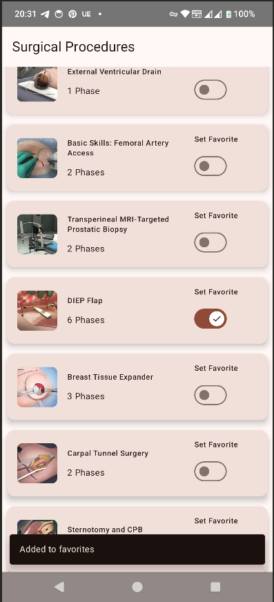
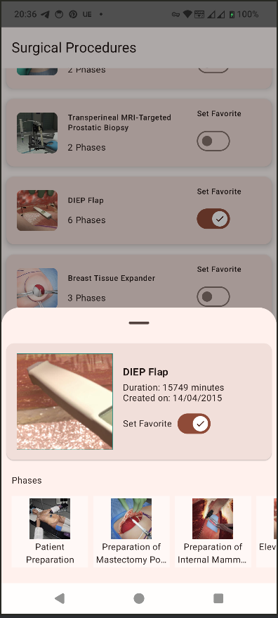
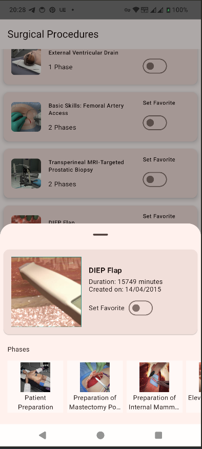

# Digital Surgery Android Tech Test

## Architecture Design
The Project follows clean Architecture with MVVM

## Libraries Used
    • Koin to provide constructor dependency injection to classes in the application
    • Retrofit to provide access to the backend API endpoints
    • Coroutines to run API network requests on background threads
    • Room to store the procedure and procedure responses from Retrofit.
    • Jetpack compose for UI
    • Mockito to mock the ViewModel and Repository classes
    • Coil for easy image loading and cacheing 

## Alternative Libraries
Dagger Hilt could be used as an alternative dependency injection library, i used koin for real simplicity

## Note
All requirements are implemented including Capability to work offline except search option which it can be done with more time dedicated.

## Further Improvements
    • Refactor project to use Pagination 3 that has been developed with Kotlin coroutines in mind. Which would require modification on the server
      side.
    • Add more tests for both unit and UI tests
    • There few hard coded strings and comments that needs few cleanup  
    • Design better ui as to treat it in production level it needs a proper design
    • Test it thorouly to check every feature is properly implemented as this is a just proof of concept.
 

     
   